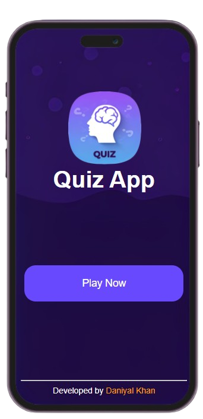

# Quiz App

A web-based multiple-choice quiz application focused on web development topics (HTML, CSS, and JavaScript). The app features a sleek mobile-style UI with a splash screen animation, randomized questions, and instant score tracking.

**Live Demo:** [https://quiz-app.daniyal-khan.com/](https://quiz-app.daniyal-khan.com/)

## Features

- Splash screen animation on load
- 10 randomized questions drawn from a question bank
- Multiple-choice answers with instant correct/incorrect feedback
- Score tracking displayed at the end of each round
- "Play Again" button to restart with a reshuffled question set
- Mobile-first design styled as an iPhone mockup

## Tech Stack

- **HTML5** — Structure and layout
- **CSS3** — Styling and animations
- **JavaScript (Vanilla)** — Quiz logic, DOM manipulation, shuffle algorithm
- **jQuery 3.5.1** — Loaded via Google CDN

## Project Structure

```
quiz-app/
├── index.html           # Main entry point
└── assests/
    ├── css/
    │   └── style.css    # All styles and animations
    ├── images/
    │   ├── logo.png
    │   ├── iphone.png
    │   ├── quiz-app.png
    │   └── quiz.png
    └── js/
        └── index.js     # Quiz logic and question bank
```

## How It Works

1. On page load, a splash screen fades in and out
2. The home screen displays with a **Play Now** button
3. Clicking **Play Now** starts the quiz with 10 randomly selected questions
4. Each question has 4 answer choices — selecting one reveals which answers are correct/incorrect
5. Click **Next** to advance through questions
6. After the final question, your score is shown out of 10
7. Click **Play Again** to reshuffle and restart

## Author

**Daniyal Khan**
- Protfolio: https://daniyal-khan.com/
- GitHub: https://github.com/daniyal-khan-dev
- LinkedIn: www.linkedin.com/in/m-daniyal-khan
- Email: support@daniyal-khan.com

## Support

If you have any questions or need help, please:
- Open on Protfolio
- Open an issue on GitHub
- Connect on LinkedIn
- Contact via email

---

<div align="center">
  <h3>🌟 If you found this project helpful, please give it a star! 🌟</h3>
  
  [](https://quiz-app.daniyal-khan.com/)
  
  
</div>
